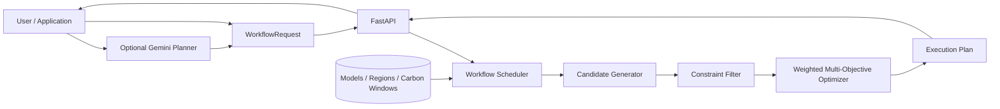

# Carbon-Aware Agent Workflow Scheduler

> **Intelligent multi-objective scheduling for AI agent workflows across models, regions, and execution windows — balancing carbon, latency, energy, cost, and accuracy constraints.**

[](https://www.python.org/)
[](https://fastapi.tiangolo.com/)
[](https://ai.google.dev/gemini-api)
[](https://pages.github.com/)

## 🌱 What is this?

AI workloads do not have to run on the first available model, region, or time slot.

This project treats an AI workflow as a scheduling problem. For every workflow task, the scheduler evaluates feasible combinations of:

- **AI model** — accuracy, latency, token cost, energy profile
- **Compute region** — network latency and grid carbon intensity
- **Execution window** — opportunity to shift work to a lower-carbon period
- **Task constraints** — minimum accuracy, deadline, delay tolerance, priority
- **User objectives** — relative importance of latency, cost, carbon and energy

The result is an **explainable execution plan** rather than a single model recommendation.

### Core idea

```text
Human / Agent Request
        │
        ▼
┌───────────────────────────┐
│ Workflow Definition       │
│ tasks + constraints       │
└─────────────┬─────────────┘
              │
              ▼
┌───────────────────────────┐
│ Candidate Generator       │
│ model × region × window   │
└─────────────┬─────────────┘
              │
              ▼
┌───────────────────────────┐
│ Constraint Filter         │
│ accuracy + deadline       │
└─────────────┬─────────────┘
              │
              ▼
┌───────────────────────────┐
│ Multi-objective Scoring   │
│ latency / cost / energy   │
│ carbon                    │
└─────────────┬─────────────┘
              │
              ▼
┌───────────────────────────┐
│ Explainable Plan          │
│ model + region + time     │
└───────────────────────────┘
```

## ✨ Key features

- Constraint-aware scheduling
- Model × region × time-window candidate search
- Carbon-aware spatial and temporal scheduling
- Weighted multi-objective optimization
- Explainable scheduling decisions
- FastAPI REST service
- Optional Gemini natural-language planning layer
- Reproducible synthetic demo data
- Portfolio landing page
- Automated GitHub Pages deployment
- Tests for core scheduling behavior

## 📊 Prototype result

The repository includes a HackDays demo scenario using **synthetic prototype data**.

| Metric | Simulated baseline | Simulated optimized plan |
|---|---:|---:|
| Cost | 0.005 | 0.0006 |
| Energy | 0.72 Wh | 0.20 Wh |
| Carbon | 0.4176 gCO₂eq | 0.00532 gCO₂eq |
| Reported carbon reduction | — | 98.73% |
| Reported cost reduction | — | 88.0% |
| Reported energy reduction | — | 72.22% |

**Important:** these are synthetic demo values, not production measurements. They demonstrate algorithm behavior and must not be presented as measured cloud savings.

## 🧠 Architecture



See [`docs/architecture.md`](docs/architecture.md).

## 🛠️ Tech stack

| Layer | Technology |
|---|---|
| API | Python, FastAPI |
| Validation | Pydantic |
| Optimization | Deterministic weighted multi-objective scoring |
| AI integration | Google GenAI SDK + Gemini structured output |
| Data | JSON prototype profiles |
| Testing | Pytest |
| Showcase | HTML/CSS/JS + GitHub Pages |

## 🚀 Run locally

```bash
git clone https://github.com/supreemtc/carbon-aware-agent-scheduler.git
cd carbon-aware-agent-scheduler
python -m venv venv
```

Windows:

```powershell
.\venv\Scripts\Activate.ps1
```

Linux/macOS:

```bash
source venv/bin/activate
```

Install and run:

```bash
pip install -r requirements.txt
uvicorn backend.main:app --reload
```

Open:

```text
http://127.0.0.1:8000/docs
```

## 🔌 API

### `GET /health`

Returns:

```json
{"status":"ok"}
```

### `GET /environment`

Returns available models, regions and execution windows.

### `POST /plan`

Accepts a typed `WorkflowRequest` and returns an `ExecutionPlan`.

The response contains:

- selected model
- selected region
- scheduling offset
- estimated latency
- estimated accuracy
- estimated cost
- estimated energy
- estimated carbon
- explanation

## 🤖 Optional Gemini mode

Gemini is used as an **intent-to-schema layer**:

```text
Natural language
      ↓
Gemini structured output
      ↓
WorkflowRequest
      ↓
Pydantic validation
      ↓
Deterministic scheduler
      ↓
ExecutionPlan
```

The LLM proposes structured requirements; the deterministic optimizer makes the infrastructure decision.

See [`docs/gemini.md`](docs/gemini.md).

## 🧮 Optimization model

For each task, the scheduler evaluates model × region × window combinations.

Candidates are rejected when:

```text
accuracy < minimum_accuracy
```

or:

```text
latency > deadline
```

Remaining metrics are normalized and combined:

```text
score =
    w_latency * normalized_latency
  + w_cost    * normalized_cost
  + w_energy  * normalized_energy
  + w_carbon  * normalized_carbon
```

Lower score is preferred.

The implementation is a **weighted-sum multi-objective optimizer**, not yet a true Pareto-frontier optimizer.

## ⚠️ Limitations

This is a research/portfolio prototype.

- Carbon intensity is synthetic.
- Model energy figures are synthetic.
- Region latency is synthetic.
- Token costs are synthetic.
- Tasks are currently optimized independently.
- There is no live cloud migration/execution engine.
- The current optimizer does not expose a true Pareto frontier.
- Reported savings are estimates based on the configured demo profiles.

## 🔭 Roadmap

### Optimization
- [ ] True Pareto frontier
- [ ] SLA penalty functions
- [ ] Uncertainty-aware scheduling
- [ ] Sensitivity analysis

### Workflow intelligence
- [ ] DAG dependencies
- [ ] Critical-path scheduling
- [ ] Agent memory/tool constraints
- [ ] Human approval gates

### Live infrastructure
- [ ] Live carbon-intensity provider
- [ ] Cloud-region latency probes
- [ ] Live model pricing
- [ ] Energy telemetry
- [ ] Historical replay

### Agentic execution
- [ ] Gemini planner
- [ ] Function calling
- [ ] Schedule approval
- [ ] Execution feedback loop
- [ ] Re-planning from observed telemetry

## 👥 Team

Add final team members and roles here.

| Member | Role |
|---|---|
| Name | Backend / Optimization |
| Name | Frontend |
| Name | AI / Gemini |
| Name | Research / Documentation |

## 📜 License

Add a license after confirming that all contributors agree on the licensing terms.
